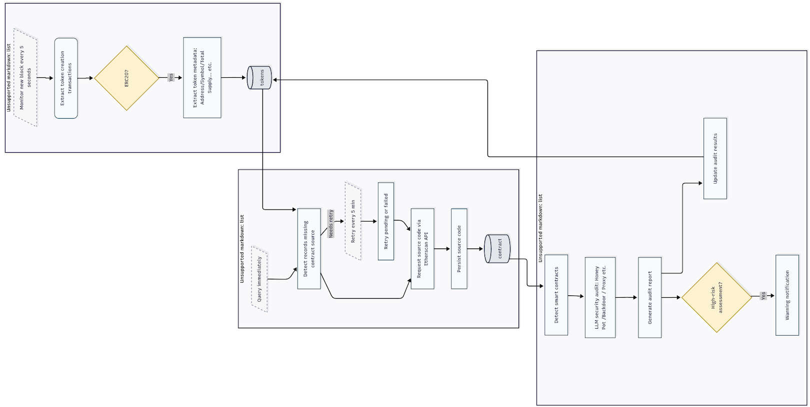

# RealTime-ICOs-DetectionSystem

## Overview

The RealTime-ICOs-DetectionSystem is a comprehensive solution for monitoring, scraping, and analyzing cryptocurrency tokens and ICOs (Initial Coin Offerings) in real-time. The system integrates smart contract analysis and social media monitoring to provide timely detection of potential scam tokens and high-risk investments in the cryptocurrency space.

## System Architecture

The system consists of two main components:

1. **Real-time Scraper Module** - Collects data from various platforms
2. **Real-time Classifier Module** - Analyzes and classifies the collected data

### Scraper Module Workflow

The Scraper Module continuously monitors and extracts data from multiple sources:

The scraper components include:
- **Token Scraper**: Extracts new token listings and offerings
- **Contracts Scraper**: Retrieves smart contract data from blockchain networks
- **DexTool Scraper**: Monitors decentralized exchanges for new token listings
- **Twitter Scraper**: Collects tweets and account data related to crypto projects
- **Social Media Extractor**: Processes social media content for analysis

### Classifier Module Workflow

The Classifier Module analyzes the collected data to detect potential scams:




The classifier components include:
- **Smart Contracts Classifier**: Analyzes contract code for suspicious patterns
- **Twitter Account Classifier**: Evaluates account legitimacy based on posting history and engagement

## System Features

- **Real-time Monitoring**: Continuous scraping of new tokens and ICOs
- **Multi-platform Data Collection**: Aggregates data from blockchain networks, exchanges, and social media
- **AI-powered Analysis**: Uses machine learning to classify potential scams
- **Database Integration**: Stores and manages collected data for further analysis
- **Automated Alerts**: Flags suspicious tokens and accounts for review

## Setup and Installation

1. Clone the repository
   ```bash
   git clone https://github.com/yourusername/RealTime-ICOs-DetectionSystem.git
   ```

2. Install required dependencies
   ```bash
   pip install -r requirements.txt
   ```

3. Configure environment variables
   - Create a `.env` file in the ClassifierScript directory
   - Add your API keys and database configuration

4. Run the system
   ```bash
   # Start the scraper modules
   ./runScraperScript.sh
   
   # Start the classifier modules
   ./runClassifierScript.sh
   ```

## Directory Structure

- **ClassifierScript/**: Contains the real-time smart contract and Twitter account detection systems
- **ScraperScript/**: Houses the data collection modules for different platforms
- **DatabaseManager/**: Manages database operations and data persistence
- **DB/**: Stores the database files
- **img/**: Contains system diagrams and documentation images

## Technologies Used

- **Python**: Primary programming language
- **SQLite**: Database management
- **Machine Learning**: Classification algorithms for scam detection
- **APIs**: Integration with blockchain explorers and social media platforms
- **Schedule**: Task scheduling for automated operation

